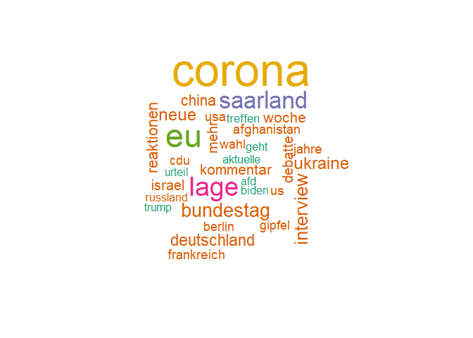

SR2 News Mining
================

<!-- analysis.md is generated from analysis.Rmd -->

# Introduction

Topics are set and public opinion is framed by broadcasting stations.
This project wants to analyze the daily news broadcasted by German radio
station SR2.

``` r
# Setup
# Load pckgs
library(knitr)
library(tidytext)
library(tidyverse)
library(RColorBrewer)
library(wordcloud)


# Load data
folder <- "data"
files <- list.files(folder, pattern = ".Rdata", full.names = TRUE)

loaded_data <- vector("list")
for (file in files) {
  load(file)
  loaded_data[[file]] <- news  # Assuming the data frames are named "news"
}

news_raw <- map2(loaded_data, names(loaded_data), ~mutate(.x, source_file = .y)) %>% 
  map(bind_rows) %>%
  list_rbind() %>% 
  as_tibble()
```

# Analysis

The data collected from the webpage goes from 2017-08-31 to 2023-11-28.

If we have a closer look on the URLs, we can see that every article has
an identification number associated which comes after the `id=`
parameter at a similar position for each URL.

``` r
news <- news_raw %>% 
  mutate(id = str_replace(Links, ".+id=(\\d+).*", "\\1"))
news %>% select(id, Links) %>% head(3) %>% kable()
```

| id    | Links                                                                               |
|:------|:------------------------------------------------------------------------------------|
| 22060 | <https://dev2.sr-mediathek.sr-multimedia.de/index.php?seite=7&id=22060&pnr=&tbl=pf> |
| 22045 | <https://dev2.sr-mediathek.sr-multimedia.de/index.php?seite=7&id=22045&pnr=&tbl=pf> |
| 22030 | <https://dev2.sr-mediathek.sr-multimedia.de/index.php?seite=7&id=22030&pnr=&tbl=pf> |

By clicking on a link, we also note, that many pages have gone offline
already. Because we have scraped the page over time, we can now observe
that a few articles have modified their news message afterwards.
However, these were only minor changes.

``` r
news %>%
  left_join(news, join_by(id), suffix = c("_Version_A", "_Version_B")) %>%
  filter(Themen_Version_A != Themen_Version_B) %>% 
  select(id, starts_with("Themen")) %>% 
  distinct(id, .keep_all = TRUE) %>% 
  kable()
news_distinct <- news %>% distinct(id, .keep_all = TRUE)
```

| id    | Themen_Version_A                                                                                                                                                                                                           | Themen_Version_B                                                                                                                                                                                                             |
|:------|:---------------------------------------------------------------------------------------------------------------------------------------------------------------------------------------------------------------------------|:-----------------------------------------------------------------------------------------------------------------------------------------------------------------------------------------------------------------------------|
| 22060 | “Planer” der IS-Miliz in Afghanistan im Visier - USA fliegen Drohnenangriff / Trotz Terrorwarnung - Tausende Menschen versuchen Kabul zu verlassen und das Interview der Woche mit Jens Spahn, Bundesgesundheitsminister   | “Planer” der IS-Miliz in Afghanistan im Visier - USA fliegen Drohnenangriff / Trotz Terrorwarnung - Tausende Menschen versuchen Kabul zu verlassen / Interview der Woche mit Jens Spahn, Bundesgesundheitsminister (CDU)     |
| 22080 | Gewagtes Schutzversprechen - Bisher nur 138 deutsche Ortskräfte ausgeflogen / Nach britischem Abzug - Kritik an Regierung Johnson / Die Preise steigen - wirklich nur vorübergehend? - Hohe Inflationsrate befürchtet      | Gewagtes Schutzversprechen - Bisher nur 138 deutsche Ortskräfte ausgeflogen / Nach britischem Abzug - Kritik an Regierung Johnson / Die Preise steigen - wirklich nur vorübergehend? Hohe Inflationsrate befürchtet          |
| 22586 | Kommentar zum Ende der Sondierungsgespräche / Ab heute Kita-Lockerungen: Fluch und Segen / Pandora Papers: Warum funktionieren Briefkastenfirmen trotz Regulierung? / EU-Parlament verurteilt Belarus / Abholzung in Kongo | Kommentar zum Ende der Sondierungsgespräche / Ab heute Kita-Lockerungen - Fluch und Segen / Pandora Papers - Warum funktionieren Briefkastenfirmen trotz Regulierung? / EU-Parlament verurteilt Belarus / Abholzung in Kongo |

Let’s examine the time frame covered by the articles.

``` r
# Articles by month
news_distinct %>%
  count(Month = floor_date(Datum, "month"),
        name = "Number of Articles") %>%
  ggplot(aes(x = Month, y = `Number of Articles`)) +
  geom_col() +
  scale_x_date(date_breaks = "6 months") +
  theme(axis.text.x = element_text(angle = 45, vjust = 1, hjust = 1))
```

<!-- -->

Our data shows two time periods that are uncovered. The first is before
August 2020. Unfortunately, SR2 seems to have deleted their data or they
simply did not upload their editions consequently before that date.
Therefore, to not bias our analysis, the 60 articles from before August
2020 are deleted (listwise deletion, since these are just a few cases).
Moreover, we identify a significant gap in information between February
and October 2022. You see, behind this code there is a human and humans
aren’t robots. Sometimes life throws in its own surprises and a unique
blend of personal events distracted me from continuing this analysis.
But I’m back in action now!😊

``` r
# Listwise deletion
news_filtered <- news_distinct %>% filter(Datum >= "2020-08-01")
```

We then observe, while Bilanz am Abend is published on weekdays, Bilanz
am Mittag also appears on Saturdays. Sunday is a holiday.

``` r
# Articles by day of week
news_filtered %>%
  count(Format,
        Weekday = wday(Datum, locale = "German", label = TRUE),
        name = "Count") %>% 
  ggplot(aes(x = Weekday, y = Count, fill = Format)) +
  geom_col()
```

<!-- -->

When focusing on the narrators, it is interesting to note how the SR
webpage content managers do not know the names of their colleagues. See
how many different spellings appear here.

``` r
# Distinct authors/narrators
news_filtered %>% distinct(Autor) %>% arrange(Autor) %>% print(n = Inf)
```

    #> # A tibble: 37 × 1
    #>    Autor                              
    #>    <chr>                              
    #>  1 Böffel, Janek                      
    #>  2 Florian Mayer                      
    #>  3 Florian mayer                      
    #>  4 Folrian Mayer                      
    #>  5 Frank Hofmann                      
    #>  6 Gallmeyer, Kerstin                 
    #>  7 Isabel Tentrup                     
    #>  8 Isabell Tentrupp                   
    #>  9 Isabelle Tentrup                   
    #> 10 Isabelle Tentrupp                  
    #> 11 Janek Böffel                       
    #> 12 Jochem Marmit                      
    #> 13 Jochen Marmit                      
    #> 14 Karin Mayer                        
    #> 15 Kathrin Aue                        
    #> 16 Katrin Aue                         
    #> 17 Katrin Aue, Janek Böffel           
    #> 18 Katrin AueFrankreich streikt weiter
    #> 19 Kerstin Gallmeyer                  
    #> 20 Lisa Krauser                       
    #> 21 Mayer, Florian                     
    #> 22 Michael Thieser                    
    #> 23 Peter Weitzmann                    
    #> 24 SR 2 KulturRadio                   
    #> 25 SR 2 Kulturradio                   
    #> 26 Sarah Sassou                       
    #> 27 Staphan Deppen                     
    #> 28 Stefan Deppen                      
    #> 29 Stephan Deppen                     
    #> 30 Stephan Deppenh                    
    #> 31 Thomas SHihabi                     
    #> 32 Thomas Shihabi                     
    #> 33 Thomas Shihabi et al.              
    #> 34 Yvonne Scheinhege                  
    #> 35 Yvonne Schleinhege                 
    #> 36 Yvonne Schleinhege-Böffel          
    #> 37 Îsabelle Tentrup

Let’s head over to analyse the content and check which news appear
within the daily news blocks.

## Keywords by number of appearence

First, we load a dictionary with German stop-words so we can delete
unnecessary words from the text corpus.

``` r
# Load dictionary
stop_words_german <-
  data.frame("Wort" = stopwords::stopwords("de", source = "snowball"))
# Delete stopwords
news_unnested <- news_filtered %>%
  unnest_tokens(output = "Wort", input = Themen) %>% 
  anti_join(stop_words_german, by = "Wort")
```

Now, let’s plot the top keywords by number of appearance.

``` r
# Keyword frecuency
top_n_keywords <- news_unnested %>%
  count(Wort, name = "Count", sort = TRUE) %>% 
  rename(Word = Wort)

top_n_keywords %>% filter(Count >= 55) %>% print(n = Inf)
```

    #> # A tibble: 33 × 2
    #>    Word        Count
    #>    <chr>       <int>
    #>  1 corona        384
    #>  2 eu            263
    #>  3 lage          206
    #>  4 saarland      179
    #>  5 interview     126
    #>  6 bundestag     125
    #>  7 neue          111
    #>  8 ukraine       111
    #>  9 deutschland   100
    #> 10 china          99
    #> 11 reaktionen     98
    #> 12 woche          89
    #> 13 kommentar      86
    #> 14 debatte        84
    #> 15 israel         84
    #> 16 mehr           82
    #> 17 jahre          77
    #> 18 frankreich     76
    #> 19 afghanistan    74
    #> 20 usa            73
    #> 21 us             71
    #> 22 wahl           71
    #> 23 berlin         69
    #> 24 gipfel         69
    #> 25 cdu            67
    #> 26 russland       64
    #> 27 geht           63
    #> 28 treffen        63
    #> 29 aktuelle       61
    #> 30 afd            58
    #> 31 biden          58
    #> 32 trump          58
    #> 33 urteil         55

The keyword frequency is visually represented by the following word
cloud.

``` r
wordcloud(top_n_keywords$Word, top_n_keywords$Count, min.freq = 55, colors = brewer.pal(6, "Dark2"))
```

<!-- -->

We see, Corona clearly dominated the news and also EU related topics
were discussed. Since SR2 is a regional broadcasting station, we also
observe the keyword Saarland. If we sum up all US related keywords that
show up (Biden, Trump, USA, US) we notice it is another dominant topic.

``` r
# Frecuency US related words
usa_keywords <- c("biden", "trump", "usa", "us")
news_unnested %>% 
  mutate(Word = ifelse(Wort %in% usa_keywords,
                       "US_keywords_summary", Wort)) %>% 
  count(Word, name = "Count", sort = TRUE) %>% 
  head(3) %>% 
  kable()
```

| Word                | Count |
|:--------------------|------:|
| corona              |   384 |
| eu                  |   263 |
| US_keywords_summary |   260 |

It is also interesting to observe the distribution of those keywords
within the week.

``` r
news_unnested %>% 
  mutate(Word = ifelse(Wort %in% usa_keywords,
                       "US_keywords_summary", Wort),
         Weekday = wday(Datum, label = TRUE)) %>% 
  count(Weekday, Word, name = "Count", sort = TRUE) %>% 
  arrange(Weekday) %>% 
  pivot_wider(names_from = Weekday, values_from = Count, values_fill = 0) %>% 
  rowwise() %>% 
  mutate(`Total Count` = sum(c_across(Mon:Sat))) %>% 
  arrange(desc(`Total Count`)) %>% 
  head(10) %>% 
  kable()
```

| Word                | Mon | Tue | Wed | Thu | Fri | Sat | Total Count |
|:--------------------|----:|----:|----:|----:|----:|----:|------------:|
| corona              |  84 |  74 |  77 |  59 |  72 |  18 |         384 |
| eu                  |  53 |  60 |  42 |  54 |  47 |   7 |         263 |
| US_keywords_summary |  31 |  48 |  51 |  44 |  48 |  38 |         260 |
| lage                |  40 |  35 |  40 |  40 |  40 |  11 |         206 |
| saarland            |  33 |  33 |  37 |  40 |  26 |  10 |         179 |
| interview           |  15 |  12 |   5 |   8 |  13 |  73 |         126 |
| bundestag           |   1 |   8 |  29 |  37 |  50 |   0 |         125 |
| neue                |  30 |  20 |  16 |  15 |  18 |  12 |         111 |
| ukraine             |  21 |  25 |  18 |  16 |  25 |   6 |         111 |
| deutschland         |  10 |  22 |  21 |  22 |  21 |   4 |         100 |

Corona and the Ukraine dominate news during the week, indicating perhaps
an avoidance of such pressing topics on weekends. Saturdays seem
reserved for more background information, as implied by the prominence
of the word “Interview”. US-related topics persist from Monday to
Saturday, and I wonder why a similar pattern doesn’t seem to hold for
other countries, such as China. Regional messages concerning the
Bundestag (the German Parliament), Saarland or the EU take center stage
during weekdays.

## Keywords over time

Let’s visualize the changing patterns of specific keyword appearances
over time.

``` r
# Select keywords
keywords <- c("lockdown", "corona", "afghanistan", "kabul", "ukraine", "russland", "gaza", "israel", "china", "türkei", "eu", "selenskyj")

# Selected keywords over time
news_unnested %>% 
  count(Wort, Month = floor_date(Datum, "month"), name = "Count") %>% 
  filter(Wort %in% keywords) %>% 
  # If keyword does not appear in certain month, insert row with explicit 0
  complete(Month = seq(
    from = floor_date(min(news_unnested$Datum), "month"),
    to = max(news_unnested$Datum),
    by = "month"),
    Wort,
    fill = list(Count = 0)) %>% 
  ggplot(aes(x = Month, y = Count, color = Wort)) +
  geom_line(size = 1) +
  # geom_line(aes(color = if_else(Monat %within% interval(as_date("2022-02-15"), as_date("2022-09-01")), NA, Wort)), size = 1) +
  geom_label(aes(label = "No data available", x = as_date("2022-06-15"), y = 0), size = 3, label.padding = unit(.15, "lines")) +
  facet_wrap(~ Wort, ncol = 3, scales = "free_y") +
  scale_x_date(breaks = "6 month") +
  theme(legend.position = "none",
        axis.text.x = element_text(angle = 75, vjust = 0.58))
```

<!-- -->

*work in progress*
