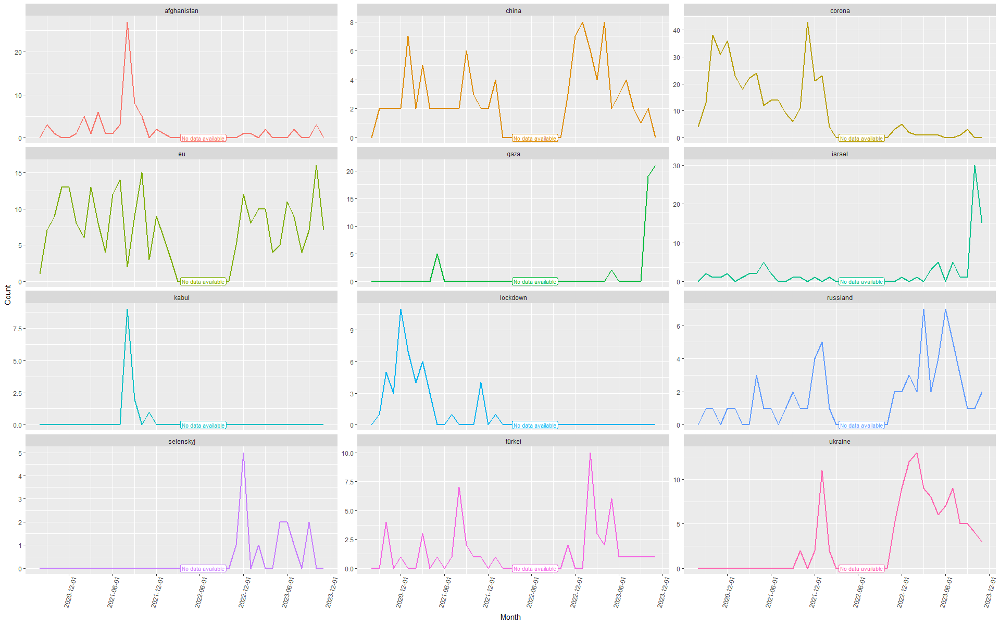

SR2 News Mining
================

<!-- analysis.md is generated from analysis.Rmd -->

# Introduction

Topics are set and public opinion is framed by broadcasting stations.
This project wants to analyze the daily news broadcasted by German radio
station SR2.

``` r
# Setup
# Load pckgs
library(knitr)
library(tidytext)
library(tidyverse)
library(RColorBrewer)
library(wordcloud)


# Load data
folder <- "data"
files <- list.files(folder, pattern = ".Rdata", full.names = TRUE)

loaded_data <- vector("list")
for (file in files) {
  load(file)
  loaded_data[[file]] <- news  # Assuming the data frames are named "news"
}

news_raw <- map2(loaded_data, names(loaded_data), ~mutate(.x, source_file = .y)) %>% 
  map(bind_rows) %>%
  list_rbind() %>% 
  as_tibble()
```

# Analysis

The data collected from the webpage goes from 2017-08-31 to 2023-11-07.

If we have a closer look on the URLs, we can see that every article has
an identification number associated which comes after the `id=`
parameter at a similar position for each URL.

``` r
news <- news_raw %>% 
  mutate(id = str_replace(Links, ".+id=(\\d+).*", "\\1"))
news %>% select(id, Links) %>% head(3) %>% kable()
```

| id    | Links                                                                               |
|:------|:------------------------------------------------------------------------------------|
| 22060 | <https://dev2.sr-mediathek.sr-multimedia.de/index.php?seite=7&id=22060&pnr=&tbl=pf> |
| 22045 | <https://dev2.sr-mediathek.sr-multimedia.de/index.php?seite=7&id=22045&pnr=&tbl=pf> |
| 22030 | <https://dev2.sr-mediathek.sr-multimedia.de/index.php?seite=7&id=22030&pnr=&tbl=pf> |

By clicking on a link, we also note, that many pages have gone offline
already. Because we have scraped the page over time, we can now observe
that a few articles have modified their news message afterwards.
However, these were only minor changes.

``` r
news %>%
  left_join(news, join_by(id), suffix = c("_Version_A", "_Version_B")) %>%
  filter(Themen_Version_A != Themen_Version_B) %>% 
  select(id, starts_with("Themen")) %>% 
  distinct(id, .keep_all = TRUE) %>% 
  kable()
news_distinct <- news %>% distinct(id, .keep_all = TRUE)
```

| id    | Themen_Version_A                                                                                                                                                                                                           | Themen_Version_B                                                                                                                                                                                                             |
|:------|:---------------------------------------------------------------------------------------------------------------------------------------------------------------------------------------------------------------------------|:-----------------------------------------------------------------------------------------------------------------------------------------------------------------------------------------------------------------------------|
| 22060 | “Planer” der IS-Miliz in Afghanistan im Visier - USA fliegen Drohnenangriff / Trotz Terrorwarnung - Tausende Menschen versuchen Kabul zu verlassen und das Interview der Woche mit Jens Spahn, Bundesgesundheitsminister   | “Planer” der IS-Miliz in Afghanistan im Visier - USA fliegen Drohnenangriff / Trotz Terrorwarnung - Tausende Menschen versuchen Kabul zu verlassen / Interview der Woche mit Jens Spahn, Bundesgesundheitsminister (CDU)     |
| 22080 | Gewagtes Schutzversprechen - Bisher nur 138 deutsche Ortskräfte ausgeflogen / Nach britischem Abzug - Kritik an Regierung Johnson / Die Preise steigen - wirklich nur vorübergehend? - Hohe Inflationsrate befürchtet      | Gewagtes Schutzversprechen - Bisher nur 138 deutsche Ortskräfte ausgeflogen / Nach britischem Abzug - Kritik an Regierung Johnson / Die Preise steigen - wirklich nur vorübergehend? Hohe Inflationsrate befürchtet          |
| 22586 | Kommentar zum Ende der Sondierungsgespräche / Ab heute Kita-Lockerungen: Fluch und Segen / Pandora Papers: Warum funktionieren Briefkastenfirmen trotz Regulierung? / EU-Parlament verurteilt Belarus / Abholzung in Kongo | Kommentar zum Ende der Sondierungsgespräche / Ab heute Kita-Lockerungen - Fluch und Segen / Pandora Papers - Warum funktionieren Briefkastenfirmen trotz Regulierung? / EU-Parlament verurteilt Belarus / Abholzung in Kongo |

Let’s examine the time frame covered by the articles.

``` r
# Articles by month
news_distinct %>%
  count(Monat = floor_date(Datum, "month"),
        name = "Artikelanzahl") %>%
  ggplot(aes(x = Monat, y = Artikelanzahl)) +
  geom_col() +
  scale_x_date(date_breaks = "3 months") +
  theme(axis.text.x = element_text(angle = 45, vjust = 1, hjust = 1))
```

<!-- -->

Our data shows two time periods that are uncovered. The first is before
August 2020. Unfortunately, SR2 seems to have deleted their data or they
simply did not upload their editions consequently before that date.
Therefore, to not bias our analysis, the 50 articles from before August
2020 are deleted (listwise deletion, since these are just a few cases).
Moreover, we identify a significant gap in information between February
and October 2022. You see, behind this code there is a human and humans
aren’t robots. Sometimes life throws in its own surprises and a unique
blend of personal events distracted me from continuing this analysis.
But I’m back in action now!😊

``` r
# Listwise deletion
news_filtered <- news_distinct %>% filter(Datum >= "2020-08-01")
```

We then observe, while Bilanz am Abend is published on weekdays, Bilanz
am Mittag also appears on Saturdays. Sunday is a holiday.

``` r
# Articles by day of week
news_filtered %>%
  count(Format,
        Wochentag = wday(Datum, locale = "German", label = TRUE),
        name = "Anzahl") %>% 
  ggplot(aes(x = Wochentag, y = Anzahl, fill = Format)) +
  geom_col()
```

<!-- -->

When focusing on the narrators, it is interesting to note how the SR
webpage content managers do not know the names of their colleagues. See
how many different spellings appear here.

``` r
# Distinct authors/narrators
news_filtered %>% distinct(Autor) %>% arrange(Autor) %>% print(n = Inf)
```

    #> # A tibble: 36 × 1
    #>    Autor                              
    #>    <chr>                              
    #>  1 Böffel, Janek                      
    #>  2 Florian Mayer                      
    #>  3 Folrian Mayer                      
    #>  4 Frank Hofmann                      
    #>  5 Gallmeyer, Kerstin                 
    #>  6 Isabel Tentrup                     
    #>  7 Isabell Tentrupp                   
    #>  8 Isabelle Tentrup                   
    #>  9 Isabelle Tentrupp                  
    #> 10 Janek Böffel                       
    #> 11 Jochem Marmit                      
    #> 12 Jochen Marmit                      
    #> 13 Karin Mayer                        
    #> 14 Kathrin Aue                        
    #> 15 Katrin Aue                         
    #> 16 Katrin Aue, Janek Böffel           
    #> 17 Katrin AueFrankreich streikt weiter
    #> 18 Kerstin Gallmeyer                  
    #> 19 Lisa Krauser                       
    #> 20 Mayer, Florian                     
    #> 21 Michael Thieser                    
    #> 22 Peter Weitzmann                    
    #> 23 SR 2 KulturRadio                   
    #> 24 SR 2 Kulturradio                   
    #> 25 Sarah Sassou                       
    #> 26 Staphan Deppen                     
    #> 27 Stefan Deppen                      
    #> 28 Stephan Deppen                     
    #> 29 Stephan Deppenh                    
    #> 30 Thomas SHihabi                     
    #> 31 Thomas Shihabi                     
    #> 32 Thomas Shihabi et al.              
    #> 33 Yvonne Scheinhege                  
    #> 34 Yvonne Schleinhege                 
    #> 35 Yvonne Schleinhege-Böffel          
    #> 36 Îsabelle Tentrup

Let’s head over to analyse the content and check which news appear
within the daily news blocks.

## Keywords by number of appearence

First, we load a dictionary with German stop-words so we can delete
unnecessary words from the text corpus.

``` r
# Load dictionary
stop_words_german <-
  data.frame("Wort" = stopwords::stopwords("de", source = "snowball"))
# Delete stopwords
news_unnested <- news_filtered %>%
  unnest_tokens(output = "Wort", input = Themen) %>% 
  anti_join(stop_words_german, by = "Wort")
```

Now, let’s plot the top keywords by number of appearance.

``` r
# Keyword frecuency
top_n_keywords <- news_unnested %>%
  count(Wort, name = "Anzahl", sort = TRUE)

top_n_keywords %>% head(30) %>% print(n = Inf)
```

    #> # A tibble: 30 × 2
    #>    Wort        Anzahl
    #>    <chr>        <int>
    #>  1 corona         384
    #>  2 eu             256
    #>  3 lage           193
    #>  4 saarland       176
    #>  5 bundestag      123
    #>  6 interview      122
    #>  7 ukraine        110
    #>  8 neue           108
    #>  9 china           99
    #> 10 reaktionen      97
    #> 11 deutschland     96
    #> 12 woche           87
    #> 13 debatte         83
    #> 14 kommentar       82
    #> 15 mehr            80
    #> 16 israel          75
    #> 17 afghanistan     74
    #> 18 frankreich      74
    #> 19 jahre           73
    #> 20 usa             73
    #> 21 us              71
    #> 22 wahl            71
    #> 23 gipfel          68
    #> 24 berlin          67
    #> 25 cdu             65
    #> 26 russland        63
    #> 27 geht            62
    #> 28 treffen         61
    #> 29 afd             58
    #> 30 aktuelle        58

The keyword frequency is visually represented by the following word
cloud.

``` r
wordcloud(top_n_keywords$Wort, top_n_keywords$Anzahl, max.words = 30, colors = brewer.pal(6, "Dark2"))
```

<!-- -->

We see, Corona clearly dominated the news and also EU related topics
were discussed. Since SR2 is a regional broadcasting station, we also
observe the keyword Saarland. If we sum up all US related keywords that
show up (Biden, Trump, USA, US) we notice it is another dominant topic,
yet before news about the EU.

``` r
# Frecuency US related words
news_unnested %>% 
  mutate(Wort = ifelse(Wort %in% c("biden", "trump", "usa", "us"),
                       "US_keywords_summary", Wort)) %>% 
  count(Wort, name = "Anzahl", sort = TRUE) %>% 
  head(3) %>% 
  kable()
```

| Wort                | Anzahl |
|:--------------------|-------:|
| corona              |    384 |
| US_keywords_summary |    259 |
| eu                  |    256 |

## Keywords over time

Let’s visualize the changing patterns of keywords appearances over time.

``` r
# Select keywords
keywords <- c("lockdown", "corona", "afghanistan", "kabul", "ukraine", "russland", "gaza", "israel", "china", "türkei", "italien", "selenskyj")

# Selected keywords over time
news_unnested %>% 
  count(Wort, Monat = floor_date(Datum, "month"), name = "Anzahl") %>% 
  filter(Wort %in% keywords) %>% 
  # If keyword does not appear in certain month, insert row with explicit 0
  complete(Monat = seq(
    from = floor_date(min(news_unnested$Datum), "month"),
    to = max(news_unnested$Datum),
    by = "month"),
    Wort,
    fill = list(Anzahl = 0)) %>% 
  ggplot(aes(x = Monat, y = Anzahl, color = Wort)) +
  geom_line(size = 1) +
  # geom_line(aes(color = if_else(Monat %within% interval(as_date("2022-02-15"), as_date("2022-09-01")), NA, Wort)), size = 1) +
  geom_label(aes(label = "No data available", x = as_date("2022-06-15"), y = 0), size = 3, label.padding = unit(.15, "lines")) +
  facet_wrap(~ Wort, ncol = 3, scales = "free_y") +
  scale_x_date(breaks = "6 month") +
  theme(legend.position = "none",
        axis.text.x = element_text(angle = 75, vjust = 0.58))
```

<!-- -->

Additional to the temporal evolution, it’s also interesting to observe
the distribution of these keywords within the week. Corona and the
Ukraine dominate news during the week, indicating perhaps an avoidance
of such pressing topics on weekends. Saturdays seem reserved for more
background information, as implied by the prominence of the word
“Interview”. US-related topics persist from Monday to Saturday, and I
wonder why a similar pattern doesn’t seem to hold for other countries,
such as China. Regional messages concerning the Bundestag (the German
Parliament), Saarland or the EU take center stage during weekdays.

``` r
news_unnested %>% 
  mutate(Wort = ifelse(Wort %in% c("biden", "trump", "usa", "us"),
                       "US_keywords_summary", Wort),
         Wochentag = wday(Datum, label = TRUE)) %>% 
  count(Wochentag, Wort, name = "Anzahl", sort = TRUE) %>% 
  arrange(Wochentag) %>% 
  pivot_wider(names_from = Wochentag, values_from = Anzahl, values_fill = 0) %>% 
  rowwise() %>% 
  mutate(Anzahl_Gesamt = sum(c_across(Mon:Sat))) %>% 
  arrange(desc(Anzahl_Gesamt)) %>% 
  head(10) %>% 
  kable()
```

| Wort                | Mon | Tue | Wed | Thu | Fri | Sat | Anzahl_Gesamt |
|:--------------------|----:|----:|----:|----:|----:|----:|--------------:|
| corona              |  84 |  74 |  77 |  59 |  72 |  18 |           384 |
| US_keywords_summary |  31 |  48 |  51 |  43 |  48 |  38 |           259 |
| eu                  |  53 |  59 |  42 |  48 |  47 |   7 |           256 |
| lage                |  38 |  31 |  36 |  38 |  40 |  10 |           193 |
| saarland            |  33 |  33 |  35 |  39 |  26 |  10 |           176 |
| bundestag           |   1 |   8 |  28 |  36 |  50 |   0 |           123 |
| interview           |  15 |  11 |   5 |   7 |  13 |  71 |           122 |
| ukraine             |  21 |  24 |  18 |  16 |  25 |   6 |           110 |
| neue                |  30 |  19 |  16 |  14 |  17 |  12 |           108 |
| china               |  23 |  21 |  17 |  17 |  18 |   3 |            99 |

*work in progress*
